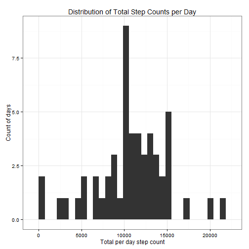
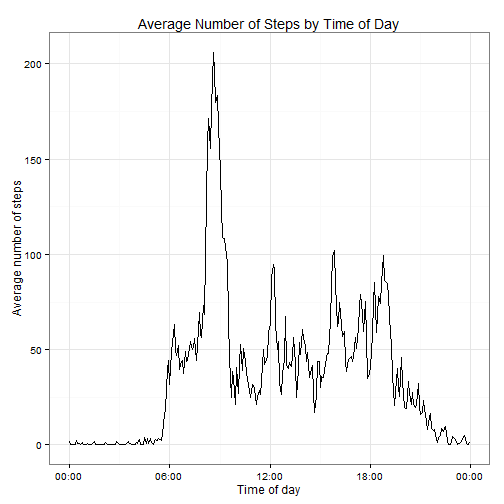
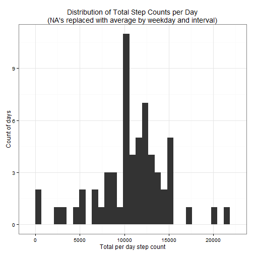
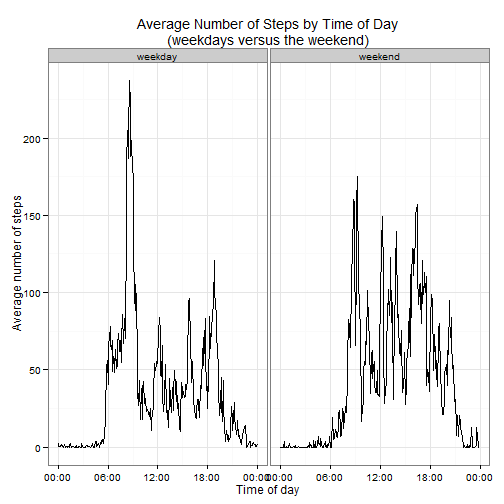
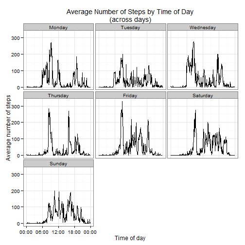

## Loading and preprocessing the data

The setup environment for this project is governed by
RepData_PeerAsssessment1.Rproj, which will automatically set the working
directory by default to the project directory. The input data can be obtained
from unzipping activity.zip into the project directory. For more information
about the data, refer to the file [README.md](https://github.com/solquist/RepData_PeerAssessment1/blob/master/README.md).

Since the assignmet calls for using "echo = TRUE" in all of the R code sections,
we just set that as a global option.


```r
library(knitr)
opts_chunk$set(echo = TRUE)
```

Here we read the data and assign to the variable "activity.raw". The data.table
function "fread()"" is used to provide more options for shaping the data and to
continue becoming familiar with leveraging data tables instead of data frames.


```r
library(data.table)
activity.raw <- fread("activity.csv")
```

The dates are currently in character format, so let's coerce them to "Date"
objects. This will help time series analysis of the data. Note that
RMarkdown behaves differently than R with the command below. In R, the statement
below changes the data table in place and does not do an automatic print. Because
there is no assignment, however, RMarkdown does do a print. The print is left in
as it gives a nice preview of the data. If we wished to supress that, however,
adding the option "results = 'hide'" would cause only the R code to show in the
final document.


```r
activity.raw[, date := as.Date(date)]
```

```
##        steps       date interval
##     1:    NA 2012-10-01        0
##     2:    NA 2012-10-01        5
##     3:    NA 2012-10-01       10
##     4:    NA 2012-10-01       15
##     5:    NA 2012-10-01       20
##    ---                          
## 17564:    NA 2012-11-30     2335
## 17565:    NA 2012-11-30     2340
## 17566:    NA 2012-11-30     2345
## 17567:    NA 2012-11-30     2350
## 17568:    NA 2012-11-30     2355
```

The "interval" data encodes the hour and minutes. For example, the time 3:08 PM
would be represented in the interval 1505 (the first two digits, in this case,
represent
the hour and second two the minutes). Because of this, it would be very useful
to also introduce a "time" column to our data set. This will also help with the
fact that the amount of time between 50 and 55 is the same
as the amount of time between 55 and 100. Let's do that now.


```r
Time <- function(interval) {
  time.string <- paste(floor(interval / 100), interval %% 100)
  as.POSIXct(time.string, format = "%H %M")
}
activity.raw[, time := Time(interval)]
```

As we have stored this as a date, the time value will also have the day this script
was run; however, we will only use the hour and minutes portion of the data.

## What is mean total number of steps taken per day?

We are going to ignore the NA values in calculating mean and median. The "ggplot"
package is used for this and other plots in the report. First we need an aggregate
set of data that gives us total number of steps per day. We assign this to the
variable "activity.raw.byday".


```r
activity.raw.byday <- activity.raw[, sum(steps), by = date]
setnames(activity.raw.byday, "V1", "steps")
```

The histogram shows the distribution of the aggregated data set, i.e. how many
days fall into the range of each bin (the default bin size for "ggplot()" is
the range of values divided by 30).


```r
library(ggplot2)

gg <- ggplot(activity.raw.byday, aes(x = steps)) + geom_histogram()
gg <- gg + theme_bw() + ggtitle("Distribution of Total Step Counts per Day") +
  xlab("Total per day step count") + ylab("Count of days")
gg
```

 

The assignment says to "Calculate and report the mean and median total number of
steps taken per day". The set of data we are working with is the "total number
of steps taken per day" (the same data used for the histogram above). So,
there is one value associated with each day and the mean and median are calculated
across that set of values as opposed to calculating a mean and median for each
day. This serves as additional information to compliment the histogram.


```r
mean <- activity.raw.byday[, mean(steps, na.rm = TRUE)]
median <- activity.raw.byday[, median(steps, na.rm = TRUE)]
```

The number of total steps per day has a mean of 1.0766 &times; 10<sup>4</sup> and a median of
10765. 

## What is the average daily activity pattern?

Now let's take a look at what the data looks like over the 5-minute intervals. At
this point we are still ignoring the missing values. To start with, lets make
a data set that aggregates the average number of steps per day by interval and
assign that to activity.raw.byinterval. We can use the "time" column we
created earlier to make sure we don't have artificial gaps in the time series
that we would get by treating interval as an integer.


```r
activity.raw.byinterval <- activity.raw[, mean(steps, na.rm = TRUE), by = time]
setnames(activity.raw.byinterval, "V1", "average.steps")
```

Now let's see what that looks like over time.


```r
library(scales)
gg <- ggplot(activity.raw.byinterval, aes(x = time, y = average.steps)) + geom_line()
gg <- gg + theme_bw() + ggtitle("Average Number of Steps by Time of Day") +
  xlab("Time of day") + ylab("Average number of steps")
gg <- gg + scale_x_datetime(labels = date_format("%H:%M"))
gg
```

 


```r
max <- activity.raw.byinterval[, max(average.steps)]
max.time <- activity.raw.byinterval[average.steps == max,][, time]
```

Using the calculations above, we can see that
the maximum average number of steps per day (206.1698) occurs during the 5-minute
interval starting at 08:35. Note how little
activity there is late at night through the early morning. It appears the peak
of activity occurs in the morning, possibly a morning walk or exercise before
work.

## Imputing missing values

Up until now, we have ignored the missing values. We can calculate the missing
values as follows:


```r
missing <- nrow(activity.raw[is.na(steps)])
```

From this we see we have 2304 missing values.

We have seen above that time of day has a significant impact on the number of
steps. In a later section, we will also be looking at the effect of weekdays
versus weeks. So, to account for missing values, I am choosing to use the
average of the number of steps by day of week and interval. To start, let's get
a table that has this mapping. Since we do not yet have a day of week column,
we will also need to add that.


```r
activity.raw[, day := weekdays(date)]
days <- c("Monday", "Tuesday", "Wednesday", "Thursday", "Friday", "Saturday", "Sunday")
activity.raw[, day := factor(day, levels = days)]
means <- activity.raw[!is.na(steps), mean(steps), by = c("day", "interval")]
setnames(means, "V1", "mean")
```

Now that we have a table of replacement values, we can fill in the missing values
from our table and assign them to the variable "activity". Since "steps" is of
type integer, we will need to coerce to double to accomodate the mean. 


```r
activity <- data.table(activity.raw)
activity[, steps := as.double(steps)]

setkey(activity, day, interval)
setkey(means, day, interval)
activity <- activity[means]
activity[is.na(steps), steps := mean]
```

Now that we have a data set where we have filled in the missing values, let's go
through the same steps as we did in the section on computing the mean and see
how they differ. As before,  we need an aggregate
set of data that gives us total number of steps per day. We assign this to the
variable "activity.byday".


```r
activity.byday <- activity[, sum(steps), by = date]
setnames(activity.byday, "V1", "steps")
```

The histogram shows the distribution of the aggregated data set, i.e. how many
days fall into the range of each bin.


```r
gg <- ggplot(activity.byday, aes(x = steps)) + geom_histogram()
gg <- gg + theme_bw() +
  ggtitle("Distribution of Total Step Counts per Day\n(NA's replaced with average by weekday and interval)") +
  xlab("Total per day step count") + ylab("Count of days")
gg
```

 

Next we calculate the mean and medians to go along with the plot above.


```r
mean <- activity.byday[, mean(steps, na.rm = TRUE)]
median <- activity.byday[, median(steps, na.rm = TRUE)]
```

The number of total steps per day has a mean of 1.0821 &times; 10<sup>4</sup> and a median of
1.1015 &times; 10<sup>4</sup>. Comparing this to the previous sections, the effect in this case is
to increase both the mean and standard deviation, so they do differ. The median
and mean also move further apart after filling in missing values. Although
the distributions
look similar in the histograms, you can see the effect of filling in the NA's.
For example, there is a spike that shows up now near 12,000 total steps that did
not show up before. Some portions of the distribution also went down in frequency.
It would also be interesting to look at how other choices for imputing the missing
values would effect the distribution. If I look at the before and after sliced
by the parameters I chose to use in my method, the averages remain the same (as
would be expected). However, when you slice the data other ways, the missing data
can cause the proportions of available data available to change and give quite
different results. This also seems to point out that poor choices in filling
the missing data could also cause problems.

## Are there differences in activity patterns between weekdays and weekends?

In order to compare the two, we will first add a factor variable to the data
set to split the data into weekdays versus weekends. As days of the week were
already used in the previous section, we are almost there.


```r
weekday <- c("Monday", "Tuesday", "Wednesday", "Thursday", "Friday")
weekend <- c("Saturday", "Sunday")
activity[day %in% weekday, day.type := "weekday"]
activity[day %in% weekend, day.type := "weekend"]
```

Now let's take a look at what the data looks like over the 5-minute intervals by
weekday versus weekend. Similar to before, we need to make
a data set that aggregates the average number of steps per day by interval and
assign that to activity.byinterval. We can use the "time" column we
created earlier to make sure we don't have artificial gaps in the time series
that we would get by treating interval as an integer.


```r
activity.byinterval <- activity[, mean(steps), by = c("day.type", "time")]
setnames(activity.byinterval, "V1", "average.steps")
```

Now let's see what that looks like over time.


```r
gg <- ggplot(activity.byinterval, aes(x = time, y = average.steps)) + geom_line()
gg <- gg + facet_grid(. ~ day.type)
gg <- gg + theme_bw() +
  ggtitle("Average Number of Steps by Time of Day\n(weekdays versus the weekend)") +
  xlab("Time of day") + ylab("Average number of steps")
gg <- gg + scale_x_datetime(labels = date_format("%H:%M"))
gg
```

 

With the data separated out by weekends and weekdays, you see some interesting
information. On the weekdays, there are obvious spikes in the morning, around
lunch time, and in the evening. On the weekend, there are many more spikes
throughout the day. Also, although both views have spikes in the morning, it
starts later on the weekend, which makes sense with people sleeping in.

As a bonus, there are also some interesting differences if you look by day.


```r
activity.byinterval <- activity[, mean(steps), by = c("day", "time")]
setnames(activity.byinterval, "V1", "average.steps")
```

Now let's see what that looks like over time.


```r
gg <- ggplot(activity.byinterval, aes(x = time, y = average.steps)) + geom_line()
gg <- gg + facet_wrap(~ day)
gg <- gg + theme_bw() +
  ggtitle("Average Number of Steps by Time of Day\n(across days)") +
  xlab("Time of day") + ylab("Average number of steps")
gg <- gg + scale_x_datetime(labels = date_format("%H:%M"))
gg
```

 

